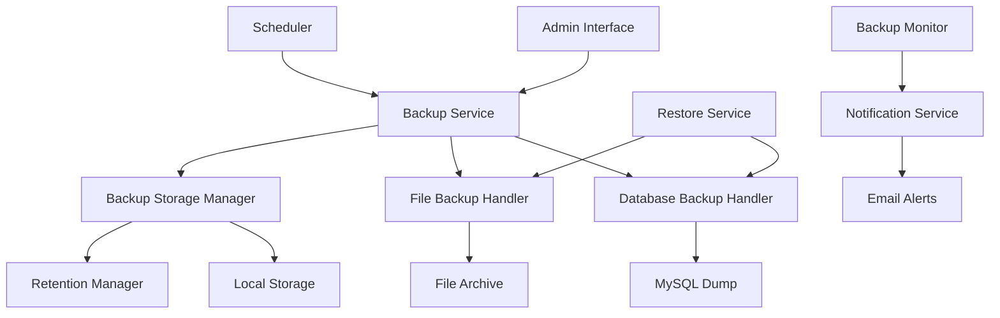

# Backup Management System Design

## Overview

The backup management system will provide comprehensive data protection for the ShipSharkLtd application through automated and manual backup capabilities. The system will handle both database backups (MySQL dumps) and file storage backups (pre-alerts and receipts), with restoration capabilities and retention management.

## Architecture

### High-Level Architecture



### Component Architecture

The system will be built using Laravel's service-oriented architecture with the following key components:

1. **BackupService**: Central orchestrator for backup operations
2. **DatabaseBackupHandler**: Manages MySQL database dumps
3. **FileBackupHandler**: Manages file storage archiving
4. **RestoreService**: Handles restoration operations
5. **BackupStorageManager**: Manages backup file storage and retention
6. **BackupMonitorService**: Monitors backup health and sends alerts

## Components and Interfaces

### Core Services

#### BackupService
```php
class BackupService
{
    public function createManualBackup(array $options = []): BackupResult
    public function scheduleAutomatedBackup(string $frequency): bool
    public function getBackupHistory(int $limit = 50): Collection
    public function getBackupStatus(): BackupStatus
    public function validateBackupIntegrity(string $backupPath): bool
}
```

#### DatabaseBackupHandler
```php
class DatabaseBackupHandler
{
    public function createDump(string $filename = null): string
    public function validateDump(string $filePath): bool
    public function getDumpSize(string $filePath): int
    public function restoreFromDump(string $filePath): bool
    public function createPreRestoreBackup(): string
}
```

#### FileBackupHandler
```php
class FileBackupHandler
{
    public function backupDirectory(string $directory, string $archiveName = null): string
    public function validateArchive(string $archivePath): bool
    public function extractArchive(string $archivePath, string $destination): bool
    public function getArchiveContents(string $archivePath): array
    public function createPreRestoreBackup(array $directories): string
}
```

#### RestoreService
```php
class RestoreService
{
    public function restoreDatabase(string $backupPath): RestoreResult
    public function restoreFiles(string $backupPath, array $directories): RestoreResult
    public function enableMaintenanceMode(): void
    public function disableMaintenanceMode(): void
    public function rollbackRestore(string $preRestoreBackup): bool
}
```

### Livewire Components

#### BackupDashboard
- Display backup status and recent history
- Trigger manual backups
- Monitor storage usage
- Show backup health metrics

#### BackupHistory
- List all backup files with metadata
- Provide download links
- Show backup sizes and creation dates
- Filter by backup type and date range

#### RestoreManager
- Select backup files for restoration
- Confirm restoration operations
- Display restoration progress
- Handle restoration rollbacks

#### BackupSettings
- Configure automated backup schedules
- Set retention policies
- Configure notification settings
- Manage backup storage locations

### Console Commands

#### BackupCommand
```php
php artisan backup:create [--database] [--files] [--name=custom-name]
```

#### RestoreCommand
```php
php artisan backup:restore {backup-file} [--database] [--files] [--force]
```

#### BackupCleanupCommand
```php
php artisan backup:cleanup [--dry-run]
```

#### BackupStatusCommand
```php
php artisan backup:status
```

## Data Models

### Backup Model
```php
class Backup extends Model
{
    protected $fillable = [
        'name',
        'type', // 'database', 'files', 'full'
        'file_path',
        'file_size',
        'status', // 'pending', 'completed', 'failed'
        'created_by',
        'metadata',
        'checksum'
    ];
    
    protected $casts = [
        'metadata' => 'array',
        'created_at' => 'datetime',
        'completed_at' => 'datetime'
    ];
}
```

### BackupSchedule Model
```php
class BackupSchedule extends Model
{
    protected $fillable = [
        'name',
        'type',
        'frequency', // 'daily', 'weekly', 'monthly'
        'time',
        'is_active',
        'retention_days',
        'last_run_at',
        'next_run_at'
    ];
    
    protected $casts = [
        'is_active' => 'boolean',
        'last_run_at' => 'datetime',
        'next_run_at' => 'datetime'
    ];
}
```

### RestoreLog Model
```php
class RestoreLog extends Model
{
    protected $fillable = [
        'backup_id',
        'restored_by',
        'restore_type',
        'status',
        'pre_restore_backup_path',
        'error_message',
        'metadata'
    ];
    
    protected $casts = [
        'metadata' => 'array',
        'started_at' => 'datetime',
        'completed_at' => 'datetime'
    ];
}
```

## Error Handling

### Backup Error Handling
- **Database Connection Failures**: Retry with exponential backoff, notify administrators
- **Disk Space Issues**: Check available space before backup, clean old backups if needed
- **Permission Errors**: Validate file permissions, provide clear error messages
- **Corruption Detection**: Verify backup integrity after creation, mark as failed if corrupt

### Restore Error Handling
- **Pre-restore Validation**: Verify backup file integrity before starting restoration
- **Rollback Mechanism**: Automatic rollback to pre-restore state on failure
- **Maintenance Mode**: Ensure application is in maintenance mode during restoration
- **Data Integrity Checks**: Verify database consistency after restoration

### Notification Strategy
- **Success Notifications**: Log successful operations, optional email notifications
- **Failure Alerts**: Immediate email alerts for backup/restore failures
- **Warning Notifications**: Storage space warnings, retention policy notifications
- **Audit Trail**: Complete logging of all backup and restore operations

## Testing Strategy

### Unit Tests
- **Service Layer Testing**: Test individual service methods with mocked dependencies
- **Handler Testing**: Test database and file backup handlers independently
- **Validation Testing**: Test backup file validation and integrity checks
- **Error Handling**: Test error scenarios and recovery mechanisms

### Integration Tests
- **End-to-End Backup**: Test complete backup workflow from trigger to completion
- **Restoration Testing**: Test database and file restoration processes
- **Schedule Testing**: Test automated backup scheduling and execution
- **Notification Testing**: Test alert and notification delivery

### Performance Tests
- **Large Database Backups**: Test backup performance with large datasets
- **File Archive Performance**: Test file backup performance with many files
- **Concurrent Operations**: Test system behavior with multiple backup operations
- **Storage Efficiency**: Test compression and storage optimization

## Security Considerations

### Access Control
- **Role-based Permissions**: Only administrators can create/restore backups
- **Audit Logging**: Log all backup and restore operations with user attribution
- **Secure File Storage**: Store backup files with restricted permissions
- **Download Security**: Secure, time-limited download links for backup files

### Data Protection
- **Encryption at Rest**: Optional encryption for backup files
- **Secure Transfer**: HTTPS for backup file downloads
- **Sensitive Data Handling**: Ensure backup files don't expose sensitive information
- **Retention Compliance**: Automatic cleanup based on data retention policies

## Configuration

### Environment Variables
```env
# Backup Configuration
BACKUP_STORAGE_PATH=storage/app/backups
BACKUP_DATABASE_RETENTION_DAYS=30
BACKUP_FILES_RETENTION_DAYS=14
BACKUP_MAX_FILE_SIZE=2048
BACKUP_COMPRESSION_LEVEL=6

# Notification Settings
BACKUP_NOTIFICATION_EMAIL=support@shopexpressja.com
BACKUP_NOTIFY_ON_SUCCESS=false
BACKUP_NOTIFY_ON_FAILURE=true

# Database Backup Settings
DB_BACKUP_TIMEOUT=300
DB_BACKUP_SINGLE_TRANSACTION=true
DB_BACKUP_ROUTINES=true
DB_BACKUP_TRIGGERS=true
```

### Backup Configuration File
```php
// config/backup.php
return [
    'storage' => [
        'path' => env('BACKUP_STORAGE_PATH', 'storage/app/backups'),
        'max_file_size' => env('BACKUP_MAX_FILE_SIZE', 2048), // MB
    ],
    
    'database' => [
        'timeout' => env('DB_BACKUP_TIMEOUT', 300),
        'single_transaction' => env('DB_BACKUP_SINGLE_TRANSACTION', true),
        'routines' => env('DB_BACKUP_ROUTINES', true),
        'triggers' => env('DB_BACKUP_TRIGGERS', true),
    ],
    
    'files' => [
        'directories' => [
            'storage/app/public/pre-alerts',
            'storage/app/public/receipts',
        ],
        'compression_level' => env('BACKUP_COMPRESSION_LEVEL', 6),
    ],
    
    'retention' => [
        'database_days' => env('BACKUP_DATABASE_RETENTION_DAYS', 30),
        'files_days' => env('BACKUP_FILES_RETENTION_DAYS', 14),
    ],
    
    'notifications' => [
        'email' => env('BACKUP_NOTIFICATION_EMAIL'),
        'notify_on_success' => env('BACKUP_NOTIFY_ON_SUCCESS', false),
        'notify_on_failure' => env('BACKUP_NOTIFY_ON_FAILURE', true),
    ],
];
```

## Implementation Phases

### Phase 1: Core Backup Infrastructure
- Database backup handler with mysqldump integration
- File backup handler with ZIP compression
- Basic backup storage management
- Console commands for manual operations

### Phase 2: Automated Scheduling
- Laravel scheduler integration
- Backup schedule management
- Retention policy implementation
- Basic monitoring and logging

### Phase 3: Restoration Capabilities
- Database restoration with rollback support
- File restoration with pre-restore backups
- Maintenance mode integration
- Restoration audit trail

### Phase 4: Admin Interface
- Livewire components for backup management
- Dashboard with backup status and history
- Settings management interface
- Download and export capabilities

### Phase 5: Advanced Features
- Email notifications and alerts
- Backup integrity monitoring
- Performance optimization
- Advanced retention policies