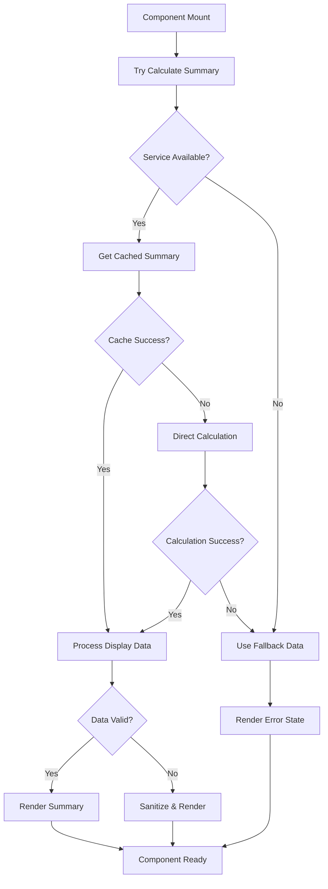

# Design Document

## Overview

The Enhanced Manifest Summary component is experiencing critical failures that result in blank screens when loading manifest data. The root cause appears to be unhandled exceptions in the data calculation pipeline, specifically in the interaction between the ManifestSummaryService, ManifestSummaryCacheService, and the component's data processing logic. This design addresses the issue through comprehensive error handling, graceful degradation, and improved data validation.

## Architecture

### Error Handling Strategy

The solution implements a multi-layered error handling approach:

1. **Component Level**: Catch and handle all exceptions in the EnhancedManifestSummary component
2. **Service Level**: Ensure ManifestSummaryService and ManifestSummaryCacheService provide safe fallbacks
3. **Data Level**: Validate and sanitize all data before processing
4. **UI Level**: Provide meaningful error states and recovery options

### Data Flow Resilience



## Components and Interfaces

### Enhanced Error Handling in EnhancedManifestSummary Component

**File**: `app/Http/Livewire/Manifests/EnhancedManifestSummary.php`

**Key Changes**:
- Wrap all data operations in try-catch blocks
- Implement progressive fallback strategy
- Add component-level error state management
- Improve logging with contextual information

**New Properties**:
```php
public bool $hasError = false;
public string $errorMessage = '';
public bool $isRetrying = false;
```

**Enhanced Methods**:
- `calculateSummary()`: Add comprehensive error handling
- `handleCalculationError()`: New method for error processing
- `retryCalculation()`: Allow users to retry failed operations
- `getEmergencyFallbackData()`: Provide minimal safe data

### Service Layer Improvements

**ManifestSummaryService Enhancements**:
- Add input validation for all methods
- Implement safe data sanitization
- Provide detailed error context in exceptions
- Add circuit breaker pattern for repeated failures

**ManifestSummaryCacheService Enhancements**:
- Improve cache availability detection
- Add cache health monitoring
- Implement graceful cache degradation
- Add cache warming strategies

### Data Validation and Sanitization

**Validation Pipeline**:
1. Manifest object validation
2. Package collection validation  
3. Numeric data range validation
4. String data sanitization
5. Array structure validation

**Sanitization Rules**:
- Numeric values: Ensure non-negative, reasonable ranges
- String values: Escape HTML, limit length
- Array values: Validate structure, remove invalid entries
- Object values: Check required properties exist

## Data Models

### Error State Model

```php
class ComponentErrorState
{
    public bool $hasError;
    public string $errorType; // 'calculation', 'cache', 'validation', 'service'
    public string $userMessage;
    public string $technicalMessage;
    public array $context;
    public bool $canRetry;
    public int $retryCount;
}
```

### Fallback Data Model

```php
class FallbackSummaryData
{
    public string $manifestType;
    public int $packageCount;
    public float $totalValue;
    public bool $incompleteData;
    public array $primaryMetric;
    public string $dataSource; // 'cache', 'calculation', 'fallback'
}
```

## Error Handling

### Exception Hierarchy

1. **ComponentException**: Base exception for component-level errors
2. **ServiceUnavailableException**: When services cannot be reached
3. **DataValidationException**: When data fails validation
4. **CacheException**: Cache-specific errors
5. **CalculationException**: Summary calculation errors

### Error Recovery Strategies

**Level 1 - Service Recovery**:
- Retry with exponential backoff
- Switch to alternative data sources
- Use cached data if available

**Level 2 - Data Recovery**:
- Sanitize invalid data
- Use partial data with warnings
- Apply default values for missing data

**Level 3 - UI Recovery**:
- Display error state with retry option
- Show partial information if available
- Maintain page functionality

### Logging Strategy

**Error Logging**:
```php
Log::error('Enhanced Manifest Summary Error', [
    'component' => 'EnhancedManifestSummary',
    'manifest_id' => $manifest->id,
    'error_type' => $errorType,
    'error_message' => $exception->getMessage(),
    'user_id' => auth()->id(),
    'request_id' => request()->header('X-Request-ID'),
    'stack_trace' => $exception->getTraceAsString(),
    'context' => $additionalContext
]);
```

**Performance Logging**:
```php
Log::info('Summary Calculation Performance', [
    'manifest_id' => $manifest->id,
    'calculation_time_ms' => $calculationTime,
    'cache_hit' => $cacheHit,
    'data_source' => $dataSource,
    'package_count' => $packageCount
]);
```

## Testing Strategy

### Unit Tests

**Component Tests**:
- Test error handling for each failure scenario
- Verify fallback data generation
- Test retry mechanisms
- Validate error state management

**Service Tests**:
- Test service failure scenarios
- Verify cache fallback behavior
- Test data validation logic
- Verify sanitization functions

### Integration Tests

**End-to-End Tests**:
- Test complete error recovery flow
- Verify UI remains functional during errors
- Test user retry interactions
- Validate error logging

**Performance Tests**:
- Test component performance under error conditions
- Verify memory usage during failures
- Test cache performance impact
- Validate error recovery time

### Error Simulation Tests

**Failure Scenarios**:
- Database connection failures
- Cache service unavailability
- Invalid manifest data
- Memory exhaustion
- Network timeouts

## Implementation Phases

### Phase 1: Core Error Handling
- Implement component-level error handling
- Add basic fallback data generation
- Improve error logging

### Phase 2: Service Resilience
- Enhance service error handling
- Implement cache fallback strategies
- Add data validation pipeline

### Phase 3: UI/UX Improvements
- Add error state UI components
- Implement retry mechanisms
- Add user-friendly error messages

### Phase 4: Monitoring and Optimization
- Add performance monitoring
- Implement health checks
- Optimize error recovery performance

## Security Considerations

**Data Sanitization**:
- Escape all user-provided data
- Validate numeric ranges to prevent overflow
- Sanitize error messages to prevent information disclosure

**Error Information**:
- Limit technical details in user-facing messages
- Log sensitive information securely
- Implement rate limiting for retry attempts

## Performance Considerations

**Error Handling Performance**:
- Minimize overhead of error checking
- Use efficient fallback data structures
- Implement smart retry strategies
- Cache error states to prevent repeated failures

**Memory Management**:
- Clean up resources during error conditions
- Prevent memory leaks in error handlers
- Optimize fallback data size