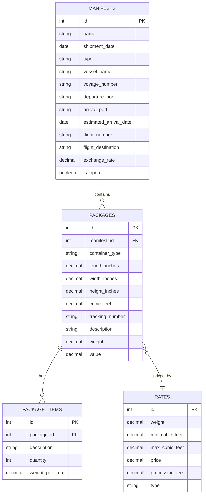

# Design Document

## Overview

This design enhances the existing Laravel/Livewire manifest system to provide specialized functionality for sea shipments. The solution extends the current architecture by adding vessel information for sea manifests, introducing container types with dimensional data, implementing multiple items per container, and establishing cubic feet-based pricing for sea freight.

The design maintains backward compatibility with existing air manifests while introducing sea-specific features through conditional logic and database schema extensions.

## Architecture

### Database Schema Changes

The design introduces several new database tables and modifies existing ones to support the enhanced functionality:

#### New Tables

**1. Package Items Table (`package_items`)**
- `id` (primary key)
- `package_id` (foreign key to packages table)
- `description` (string, required)
- `quantity` (integer, required, default: 1)
- `weight_per_item` (decimal, optional)
- `created_at`, `updated_at` (timestamps)

**2. Sea Rates Table (extends existing rates functionality)**
- Modify existing `rates` table to support cubic feet ranges
- Add `min_cubic_feet` (decimal, nullable)
- Add `max_cubic_feet` (decimal, nullable)
- Existing `weight` column becomes nullable for sea rates
- `type` column distinguishes between 'air' (weight-based) and 'sea' (cubic feet-based)

#### Modified Tables

**1. Manifests Table Extensions**
- Add `vessel_name` (string, nullable)
- Add `voyage_number` (string, nullable)
- Add `departure_port` (string, nullable)
- Add `arrival_port` (string, nullable)
- Add `estimated_arrival_date` (date, nullable)

**2. Packages Table Extensions**
- Add `container_type` (enum: 'box', 'barrel', 'pallet', nullable)
- Add `length_inches` (decimal, nullable)
- Add `width_inches` (decimal, nullable)
- Add `height_inches` (decimal, nullable)
- Add `cubic_feet` (decimal, nullable, calculated field)

### Application Layer Architecture

The design follows the existing Laravel/Livewire pattern with these key components:

#### Models
- **Manifest Model**: Extended with vessel information and sea-specific relationships
- **Package Model**: Enhanced with container types, dimensions, and cubic feet calculations
- **PackageItem Model**: New model for managing multiple items per container
- **Rate Model**: Extended to support both weight-based and cubic feet-based pricing

#### Livewire Components
- **Manifest Component**: Enhanced with conditional vessel/flight fields based on type
- **EditManifest Component**: Updated to handle vessel information for sea manifests
- **ManifestPackage Component**: Extended with container types, dimensions, and items management
- **EditManifestPackage Component**: Updated to support sea-specific package features

#### Services/Utilities
- **CubicFeetCalculator**: Utility class for dimensional calculations
- **SeaRateCalculator**: Service for cubic feet-based pricing calculations
- **ManifestTypeHandler**: Service to manage type-specific logic and field visibility

## Components and Interfaces

### 1. Enhanced Manifest Management

#### Manifest Creation/Editing Interface
```php
// Conditional field rendering based on manifest type
if ($this->type === 'sea') {
    // Show vessel fields: vessel_name, voyage_number, departure_port, etc.
} else {
    // Show flight fields: flight_number, flight_destination, etc.
}
```

#### Manifest Model Extensions
```php
class Manifest extends Model
{
    protected $fillable = [
        // Existing fields
        'name', 'shipment_date', 'reservation_number', 'exchange_rate', 'type', 'is_open',
        // New vessel fields
        'vessel_name', 'voyage_number', 'departure_port', 'arrival_port', 'estimated_arrival_date',
        // Existing flight fields (conditional)
        'flight_number', 'flight_destination'
    ];

    public function isSeaManifest(): bool
    {
        return $this->type === 'sea';
    }

    public function getTransportInfoAttribute(): array
    {
        return $this->isSeaManifest() 
            ? ['vessel' => $this->vessel_name, 'voyage' => $this->voyage_number]
            : ['flight' => $this->flight_number, 'destination' => $this->flight_destination];
    }
}
```

### 2. Container Type and Dimensional Management

#### Package Model Extensions
```php
class Package extends Model
{
    protected $fillable = [
        // Existing fields
        'user_id', 'manifest_id', 'shipper_id', 'office_id', 'tracking_number', 
        'description', 'weight', 'value', 'status', 'estimated_value',
        // New container fields
        'container_type', 'length_inches', 'width_inches', 'height_inches', 'cubic_feet'
    ];

    protected $casts = [
        'cubic_feet' => 'decimal:3'
    ];

    public function calculateCubicFeet(): float
    {
        if ($this->length_inches && $this->width_inches && $this->height_inches) {
            return round(($this->length_inches * $this->width_inches * $this->height_inches) / 1728, 3);
        }
        return 0;
    }

    public function items()
    {
        return $this->hasMany(PackageItem::class);
    }

    public function isSeaPackage(): bool
    {
        return $this->manifest->type === 'sea';
    }
}
```

#### PackageItem Model
```php
class PackageItem extends Model
{
    protected $fillable = [
        'package_id', 'description', 'quantity', 'weight_per_item'
    ];

    protected $casts = [
        'quantity' => 'integer',
        'weight_per_item' => 'decimal:2'
    ];

    public function package()
    {
        return $this->belongsTo(Package::class);
    }

    public function getTotalWeightAttribute(): float
    {
        return $this->quantity * ($this->weight_per_item ?? 0);
    }
}
```

### 3. Enhanced Package Creation Interface

#### ManifestPackage Component Extensions
```php
class ManifestPackage extends Component
{
    // Existing properties
    public $user_id, $manifest_id, $shipper_id, $office_id;
    public $warehouse_receipt_no, $tracking_number, $description, $weight, $value;
    
    // New sea-specific properties
    public $container_type = '';
    public $length_inches = '';
    public $width_inches = '';
    public $height_inches = '';
    public $cubic_feet = 0;
    public $items = [];
    
    protected $listeners = ['dimensionsUpdated' => 'calculateCubicFeet'];

    public function mount()
    {
        parent::mount();
        $this->initializeItems();
    }

    public function calculateCubicFeet()
    {
        if ($this->length_inches && $this->width_inches && $this->height_inches) {
            $this->cubic_feet = round(
                ($this->length_inches * $this->width_inches * $this->height_inches) / 1728, 
                3
            );
        }
    }

    public function addItem()
    {
        $this->items[] = [
            'description' => '',
            'quantity' => 1,
            'weight_per_item' => ''
        ];
    }

    public function removeItem($index)
    {
        unset($this->items[$index]);
        $this->items = array_values($this->items);
    }

    public function isSeaManifest(): bool
    {
        $manifest = Manifest::find($this->manifest_id);
        return $manifest && $manifest->type === 'sea';
    }
}
```

### 4. Cubic Feet-Based Pricing System

#### Rate Model Extensions
```php
class Rate extends Model
{
    protected $fillable = [
        'weight', 'min_cubic_feet', 'max_cubic_feet', 'price', 'processing_fee', 'type'
    ];

    public function scopeForSeaShipment($query, $cubicFeet)
    {
        return $query->where('type', 'sea')
                    ->where('min_cubic_feet', '<=', $cubicFeet)
                    ->where('max_cubic_feet', '>=', $cubicFeet);
    }

    public function scopeForAirShipment($query, $weight)
    {
        return $query->where('type', 'air')
                    ->where('weight', $weight);
    }
}
```

#### SeaRateCalculator Service
```php
class SeaRateCalculator
{
    public function calculateFreightPrice(Package $package): float
    {
        if (!$package->isSeaPackage()) {
            throw new InvalidArgumentException('Package must be for sea manifest');
        }

        $cubicFeet = $package->cubic_feet;
        $rate = Rate::forSeaShipment($cubicFeet)->first();
        
        if (!$rate) {
            // Use default rate or throw exception
            $rate = Rate::where('type', 'sea')->orderBy('max_cubic_feet')->first();
        }

        $manifest = $package->manifest;
        $exchangeRate = $manifest->exchange_rate;

        return ($rate->price * $cubicFeet + $rate->processing_fee) * $exchangeRate;
    }
}
```

## Data Models

### Entity Relationship Diagram



### Data Validation Rules

#### Manifest Validation
```php
// Sea manifest validation
if ($this->type === 'sea') {
    $rules = [
        'vessel_name' => 'required|string|max:255',
        'voyage_number' => 'required|string|max:255',
        'departure_port' => 'required|string|max:255',
        'arrival_port' => 'nullable|string|max:255',
        'estimated_arrival_date' => 'nullable|date|after:shipment_date'
    ];
} else {
    // Air manifest validation (existing)
    $rules = [
        'flight_number' => 'required|string|max:255',
        'flight_destination' => 'required|string|max:255'
    ];
}
```

#### Package Validation
```php
// Sea package validation
if ($this->isSeaManifest()) {
    $rules = [
        'container_type' => 'required|in:box,barrel,pallet',
        'length_inches' => 'required|numeric|min:0.1',
        'width_inches' => 'required|numeric|min:0.1',
        'height_inches' => 'required|numeric|min:0.1',
        'items' => 'required|array|min:1',
        'items.*.description' => 'required|string|max:255',
        'items.*.quantity' => 'required|integer|min:1'
    ];
}
```

## Error Handling

### Validation Errors
- **Missing vessel information**: Clear error messages for required vessel fields
- **Invalid dimensions**: Validation for positive numeric values with appropriate minimums
- **Missing container type**: Required field validation with clear options
- **Empty items list**: Ensure at least one item is added for sea packages

### Calculation Errors
- **Rate not found**: Graceful handling when no matching cubic feet rate exists
- **Division by zero**: Protection against invalid dimensional calculations
- **Negative values**: Validation to prevent negative dimensions or quantities

### Data Integrity
- **Orphaned items**: Cascade deletion when packages are removed
- **Type consistency**: Ensure package container types only exist for sea manifests
- **Rate type matching**: Validate that sea packages use sea rates and air packages use air rates

## Testing Strategy

### Unit Tests
1. **Model Tests**
   - Cubic feet calculation accuracy
   - Rate lookup for different cubic feet ranges
   - Manifest type detection and conditional logic
   - Package item relationships and calculations

2. **Service Tests**
   - SeaRateCalculator with various cubic feet values
   - CubicFeetCalculator with different dimensions
   - Edge cases for rate calculations

### Integration Tests
1. **Livewire Component Tests**
   - Manifest creation with vessel information
   - Package creation with container types and dimensions
   - Real-time cubic feet calculation
   - Items management (add/remove/edit)

2. **Database Tests**
   - Migration rollback/forward compatibility
   - Foreign key constraints
   - Data seeding for sea rates

### Feature Tests
1. **End-to-End Workflows**
   - Complete sea manifest creation process
   - Package addition with multiple items
   - Pricing calculation verification
   - Type-specific field visibility

2. **User Interface Tests**
   - Form validation and error display
   - Dynamic field showing/hiding based on manifest type
   - Real-time calculations and updates

### 5. Searchable Customer Dropdown

#### Enhanced Customer Selection Interface
The customer dropdown will be enhanced with real-time search functionality to improve usability when dealing with large customer lists.

#### Implementation Approach
```php
class ManifestPackage extends Component
{
    public $customerSearch = '';
    public $showCustomerDropdown = false;
    public $filteredCustomers = [];
    
    public function updatedCustomerSearch()
    {
        if (strlen($this->customerSearch) >= 1) {
            $this->filteredCustomers = User::where('role_id', 3)
                ->where('email_verified_at', '!=', '')
                ->search($this->customerSearch)
                ->orderBy('last_name', 'asc')
                ->limit(10)
                ->get();
            $this->showCustomerDropdown = true;
        } else {
            $this->filteredCustomers = [];
            $this->showCustomerDropdown = false;
        }
    }
    
    public function selectCustomer($customerId)
    {
        $customer = User::find($customerId);
        $this->user_id = $customerId;
        $this->customerSearch = $customer->full_name . " (" . $customer->profile->account_number . ")";
        $this->showCustomerDropdown = false;
    }
}
```

#### Frontend Implementation
The search interface will use a combination of input field with dropdown results:
- Input field for typing search terms
- Dropdown list showing filtered results
- Click-to-select functionality
- Keyboard navigation support (up/down arrows, enter to select)

### Performance Tests
1. **Database Query Optimization**
   - Rate lookup performance with cubic feet ranges
   - Package loading with items relationships
   - Manifest listing with type-specific data
   - Customer search query performance with large datasets

2. **Calculation Performance**
   - Cubic feet calculations for large datasets
   - Bulk pricing calculations for multiple packages

3. **Search Performance**
   - Customer search response time with large customer databases
   - Real-time search filtering performance